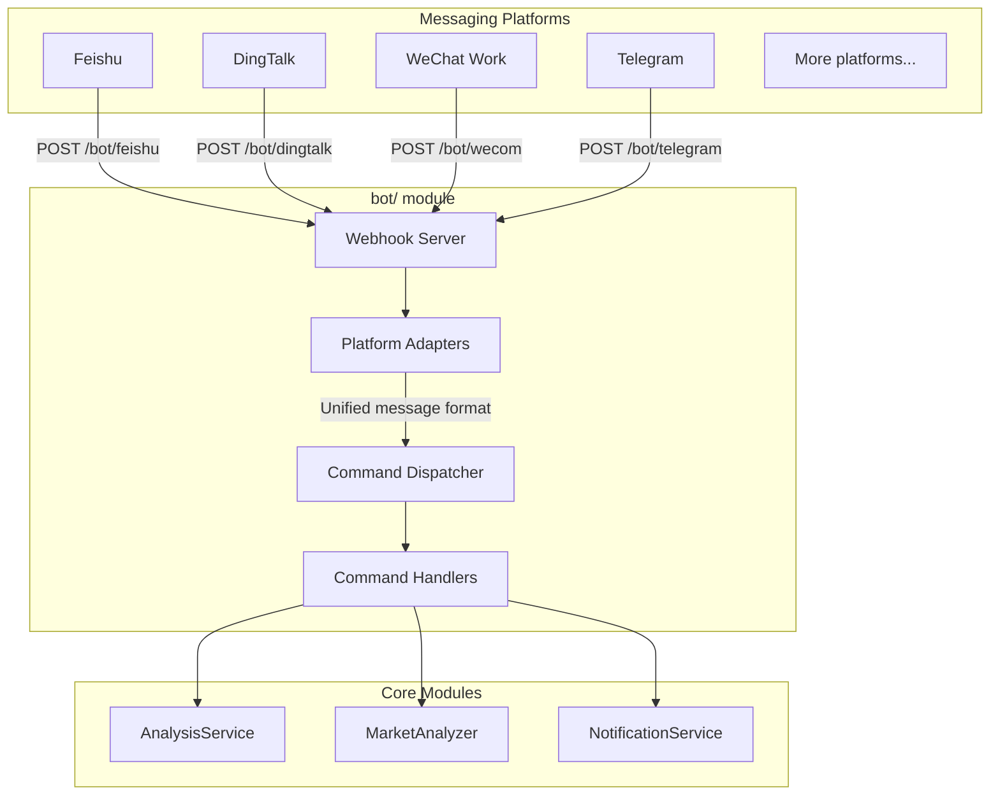

# Bot Integration Guide

This document covers the bot module architecture, supported commands, webhook routes, and how to configure platform integrations.

> **Glossary:** "Enterprise bot" in this context means a chatbot that receives commands via webhook from a messaging platform (Feishu / DingTalk / WeChat Work / Telegram) and calls the analysis pipeline to reply inline.

---

## 1. Architecture Overview



---

## 2. Directory Structure

```
bot/
├── __init__.py             # Module entry, exports main classes
├── models.py               # Unified message/response models
├── dispatcher.py           # Command dispatcher (core)
├── commands/               # Command handlers
│   ├── __init__.py
│   ├── base.py             # Abstract base class for commands
│   ├── analyze.py          # /analyze — stock analysis
│   ├── market.py           # /market — market review
│   ├── help.py             # /help — help text
│   └── status.py           # /status — system status
└── platforms/              # Platform adapters
    ├── __init__.py
    ├── base.py             # Abstract base class for platforms
    ├── feishu.py           # Feishu (Lark) bot
    ├── dingtalk.py         # DingTalk bot
    ├── dingtalk_stream.py  # DingTalk Stream bot
    ├── wecom.py            # WeChat Work bot (in development)
    └── telegram.py         # Telegram bot (in development)
```

---

## 3. Core Abstractions

### 3.1 Unified Message Model (`bot/models.py`)

```python
@dataclass
class BotMessage:
    platform: str       # Platform ID: feishu / dingtalk / wecom / telegram
    user_id: str        # Sender ID
    user_name: str      # Sender display name
    chat_id: str        # Conversation ID (group or DM)
    chat_type: str      # Conversation type: group / private
    content: str        # Message text
    raw_data: Dict      # Raw request data (platform-specific)
    timestamp: datetime
    mentioned: bool = False  # Whether the bot was @-mentioned

@dataclass
class BotResponse:
    text: str
    markdown: bool = False  # Whether the response is Markdown
    at_user: bool = True    # Whether to @-mention the sender
```

### 3.2 Platform Adapter Base (`bot/platforms/base.py`)

```python
class BotPlatform(ABC):
    @property
    @abstractmethod
    def platform_name(self) -> str: ...

    @abstractmethod
    def verify_request(self, headers: Dict, body: bytes) -> bool:
        """Verify request signature (security check)"""
        ...

    @abstractmethod
    def parse_message(self, data: Dict) -> Optional[BotMessage]:
        """Parse platform message into unified format"""
        ...

    @abstractmethod
    def format_response(self, response: BotResponse) -> Dict:
        """Convert unified response to platform format"""
        ...
```

### 3.3 Command Base Class (`bot/commands/base.py`)

```python
class BotCommand(ABC):
    @property
    @abstractmethod
    def name(self) -> str: ...          # e.g. 'analyze'

    @property
    @abstractmethod
    def aliases(self) -> List[str]: ... # e.g. ['a', 'analyse']

    @property
    @abstractmethod
    def description(self) -> str: ...

    @property
    @abstractmethod
    def usage(self) -> str: ...

    @abstractmethod
    async def execute(self, message: BotMessage, args: List[str]) -> BotResponse: ...
```

---

## 4. Supported Commands

| Command | Aliases | Description | Example |
|---------|---------|-------------|---------|
| `/analyze` | `/a` | Analyze a specific stock | `/analyze AAPL` or `/analyze 600519` |
| `/market` | `/m` | Market review (A-shares / US stocks) | `/market` |
| `/batch` | `/b` | Batch-analyze your watchlist | `/batch` |
| `/help` | `/h` | Show help text | `/help` |
| `/status` | `/s` | Show system status | `/status` |

> **Stock code formats:** A-shares use 6-digit codes (e.g. `600519`); HK stocks prefix `hk` (e.g. `hk00700`); US stocks use ticker symbols (e.g. `AAPL`, `TSLA`).

---

## 5. Webhook Routes

Registered in `api/v1/router.py`:

| Route | Method | Platform |
|-------|--------|----------|
| `/bot/feishu` | POST | Feishu (Lark) event callback |
| `/bot/dingtalk` | POST | DingTalk event callback |
| `/bot/wecom` | POST | WeChat Work event callback (in development) |
| `/bot/telegram` | POST | Telegram update callback (in development) |

---

## 6. Configuration

Add the following to your `.env` (see `.env.example` for the full template):

```dotenv
# --- Bot general ---
BOT_ENABLED=false
BOT_COMMAND_PREFIX=/

# --- Feishu (Lark) bot ---
FEISHU_APP_ID=
FEISHU_APP_SECRET=
FEISHU_VERIFICATION_TOKEN=    # Event verification token
FEISHU_ENCRYPT_KEY=           # Encryption key (optional)

# --- DingTalk bot ---
DINGTALK_APP_KEY=
DINGTALK_APP_SECRET=

# --- WeChat Work bot (in development) ---
WECOM_TOKEN=
WECOM_ENCODING_AES_KEY=

# --- Telegram bot ---
TELEGRAM_BOT_TOKEN=           # Get from @BotFather
TELEGRAM_WEBHOOK_SECRET=      # Webhook secret token
```

---

## 7. Extending the Bot

### Adding a new platform adapter

1. Create a new file in `bot/platforms/`.
2. Subclass `BotPlatform` and implement `verify_request`, `parse_message`, `format_response`.
3. Register a webhook endpoint in `api/v1/router.py`.

### Adding a new command

1. Create a new file in `bot/commands/`.
2. Subclass `BotCommand` and implement the `execute` method.
3. Register the command in the dispatcher startup code.
